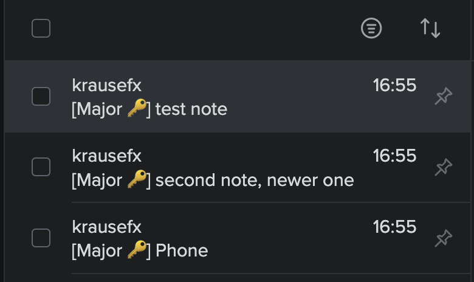
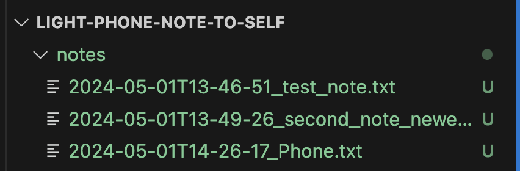

# light-phone-note-to-self

> A simple script to fetch the most recent Notes from your Light Phone and send them to yourself via Email

## Background & Vision

When using the Light Phone on-the-go, I want to quickly jot down notes, and not forget about them. Usually the notes are actionable, and I want to make sure I don't forget about them. Hence, I want my notes to land in my email inbox (aka my todo list inbox).



### Send them to yourself via Email

I'm a big fan of Inbox Zero, and as such, all my incoming emails are actionable. I already heavily use [Email Me](https://apps.apple.com/de/app/note-taking-email-me/id1090744587) on my iPhone, and a self-built plugin for Raycast (there is also a more [powerful Raycast plugin](https://www.raycast.com/peduarte/dash-off) available, however I want it to be a single-click feature).

Using this script, every time you write a new note on your Light Phone, it will automatically be sent to your email inbox, allowing you to process it later.

### Export your notes from the Light Phone



As an additional backup, it can be useful to export your notes from the Light Phone. The notes will be stored as plain-text files on your computer locally, allowing you to easily search, archive, and share them.

## Installation

1. `git clone https://github.com/KrauseFx/light-phone-note-to-self`
1. `cd light-phone-note-to-self`
1. `bundle install`
1. `cp .env.example .env`

## Configuration

```sh
# Login on https://dashboard.thelightphone.com/ and copy the token from the network tab, including the "Bearer " prefix
export BEARER_TOKEN="Bearer ..."

# Select your device from the Light Phone dashboard, and copy the device ID from the URL
export DEVICE_TOOL_ID=""

# Your Sendgrid API key
export SENDGRID_BEARER_TOKEN="Bearer ..."

# The email address you want to send from
export SENDGRID_FROM=""

# The email address you want to send to
export SENDGRID_TO=""
```

## Usage

```sh
bundle exec ruby run.rb
```

## Run on a schedule

There are many different ways to run scripts on a schedule, for example using `cron` on macOS or Linux. To run the script every hour, you can use the following steps:

1. `crontab -e`
1. Add a new line with the following content, which will run the script every hour your computer is running:
```
0 * * * * /bin/bash -l -c 'cd /absolute_path/light-phone-note-to-self && source .keys && /absolute_path_to/bundle exec ruby run.rb > /absolute_path/light-phone-note-to-self/stdout.log 2> /absolute_path/light-phone-note-to-self/stderr.log'```

Note that each setup is different, and `crontab` may be tricky to deal with. You can see how I'm pointing directly to my `bundle` binary (you can get it by running `which bundle`) to prevent any issues with the `PATH` variable.

## Known Limitations

- [ ] If you update an existing note, it won't get re-processed
- [ ] No support for audio notes
